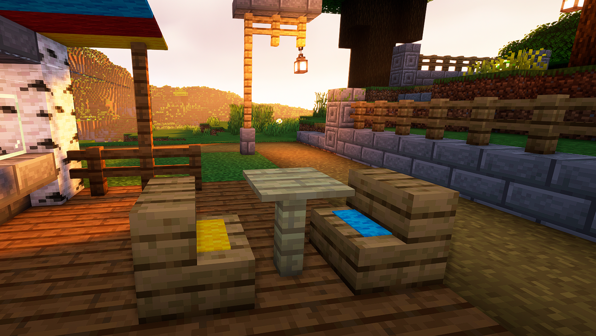

# BlockSeats Spigot

## About

BlockSeats is a simple light-weight plugin for Minecraft Spigot servers (and forks). It allows players to easily turn stairs and slab blocks into functional seats that any player can sit on.

This opens a world of decorating, building and spacing possibilities to constructions, as well as interesting social activities, such as meetings or gatherings.

### **Design philosophy**

- As vanilla as possible. Make it feel a part of the game, just as natural as riding a boat or a minecart
- Commands-free. Regular players shouldn't type a command to take a seat.
- Safe. The plugin works by spawning entities. Getting rid of them properly is a top priority.
- Light. This is a simple and small plugin. With tittle to null performance impact in a server.
- Funny. Players should have fun building, mixing stairs / slabs materials and carpet colors and just sitting together.

## Usage

### **Creating a seat**

To turn a block into a chair it must be either stair going up or a bottom slab.

A player must simply right-click the block with any variation of a carped block in their hand. The carpet item will be removed from their inventory and it'll be displayed on top of the stair or slab. Whenever a player sees a carpet on a stair/slab, that means they can seat on it.

### **Sitting**

Right click on the block. That's all! 😁

### **Getting off a seat**

Shift! 🤪

## Installation

Drop the latest release `.jar` file in your plugins folder.

## How it works?

- When a player right-clicks a block, the plugin checks if the block has ben marked as a chair. If so, an invisible, marker, invulnerable armor stand will be spawned. The position varies depending on the type of block, facing and direction of the player in relation to the block; then the player is teleported to face to the seat direction and set a an passenger of the spawned armor stand.
    - if there's already an armor stand mapped to a clicked seat with a player on it, the operation is cancelled. (Only one player per seat at a time)

- When a the player dismounts the armor stand by pressing shift, being killed, changing seat, etc... the spawned armor stand will be de-spawned.
- If the clicked block is not marked as a seat but the player has a carped in their hand, the carped item is taken from their inventory, the block is marked as a seat an a persistent armor stand is spawned to displaying the carped in the helmet slot.
- When a seat block is updated, the plugin checks if it's still a valid seat-elegible block (stairs going up/bottom slabs), if it isn't any longer, the carpet item is dropped and the block is un-marked as a seat.
- On every chunk unload, the plugin checks for any "ghost" mounting armor stand and de-spawns them if there's any (just a safety measure for edge cases)

## Have fun!!
